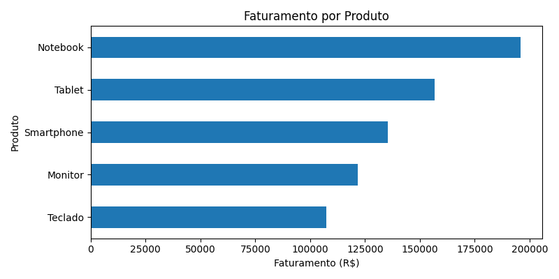
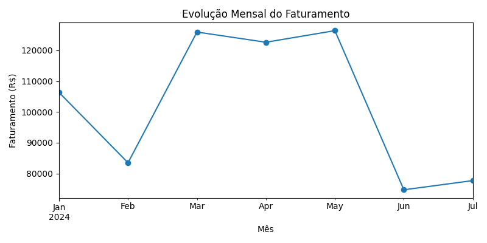

# Análise de Performance Comercial com Python

Este projeto apresenta uma análise exploratória de dados de vendas com o objetivo de identificar padrões de faturamento, participação de produtos e evolução das vendas ao longo do tempo.

---

## Objetivo

Aplicar técnicas de análise de dados utilizando Python para explorar um conjunto de dados de vendas e gerar insights que possam apoiar decisões comerciais.

---

## Tecnologias utilizadas

- Python
- Pandas
- Matplotlib
- Jupyter Notebook

---

## Análises realizadas

### Faturamento por produto
Análise do faturamento total de cada produto para identificar os itens com maior impacto financeiro.

### Evolução mensal de vendas
Visualização da variação do faturamento ao longo dos meses.

### Participação percentual
Cálculo da representatividade de cada produto no faturamento total.

---

## Principais insights

- O produto **Notebook** apresentou a maior participação no faturamento total.
- A distribuição do faturamento entre os produtos é relativamente equilibrada.
- O mês de **maio apresentou o maior volume de vendas** no período analisado.

---

## Autor

Projeto desenvolvido como parte da construção de portfólio na área de **Análise de Dados**.

---

## Visualizações

### Faturamento por Produto

### Evolução Mensal do Faturamento

### Participação Percentual do Faturamento

---

## Conclusão

A análise permitiu identificar padrões importantes no desempenho de vendas, como os produtos com maior impacto financeiro e as variações de faturamento ao longo do tempo.

Projetos neste formato demonstram como ferramentas de análise de dados podem ser utilizadas para apoiar decisões estratégicas em ambientes comerciais, identificando tendências e oportunidades de melhoria.
